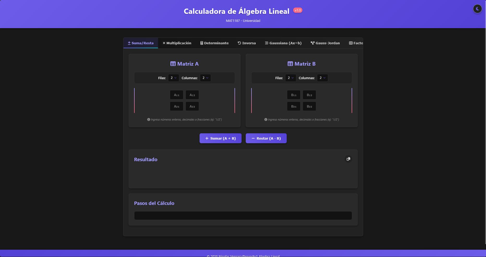
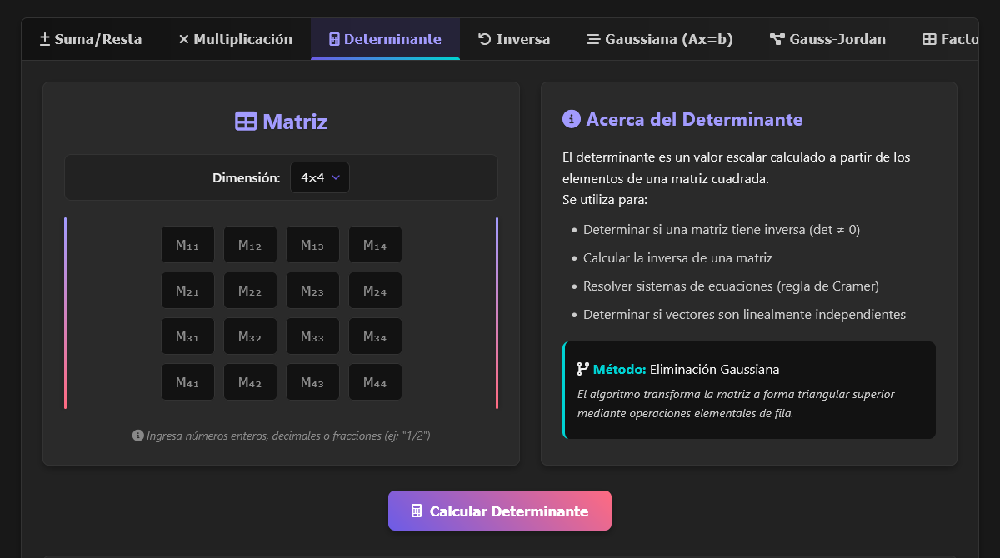
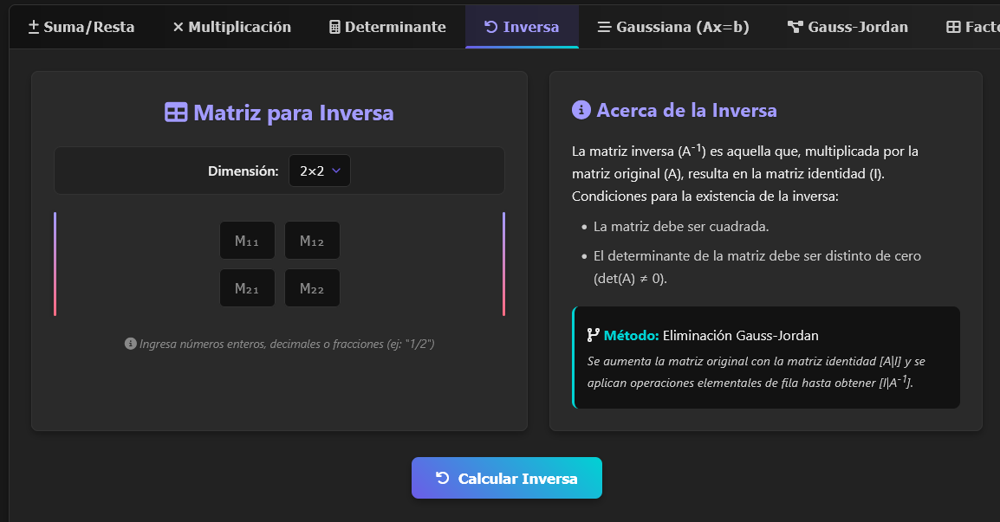
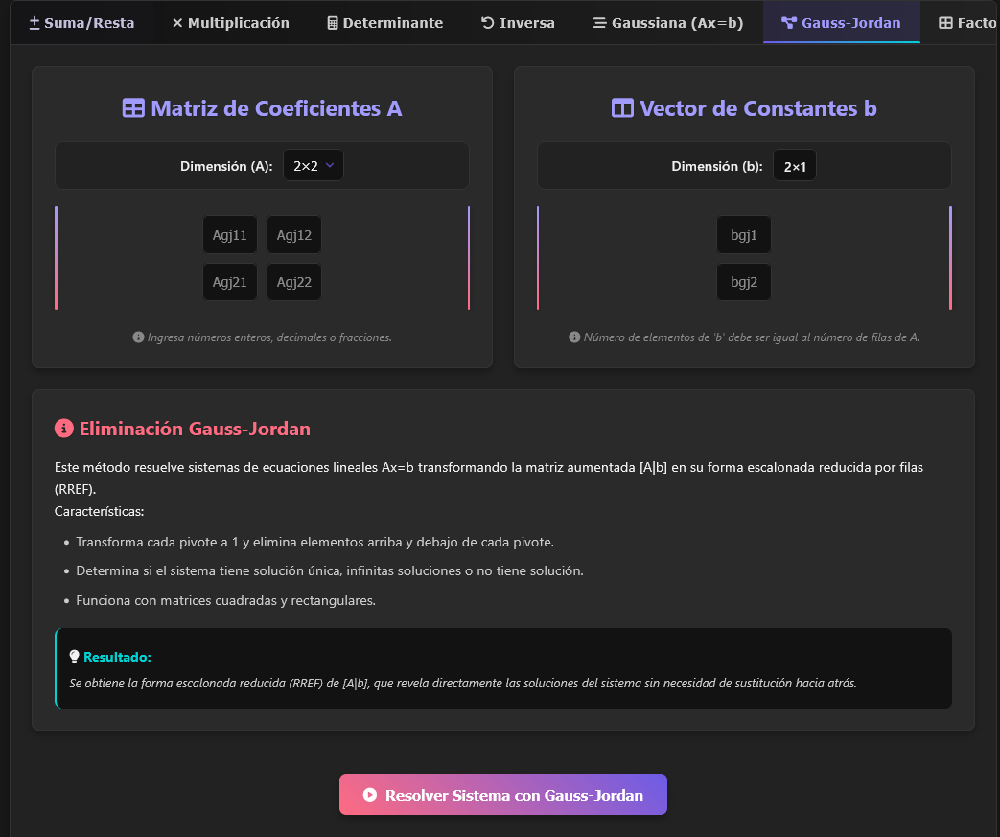
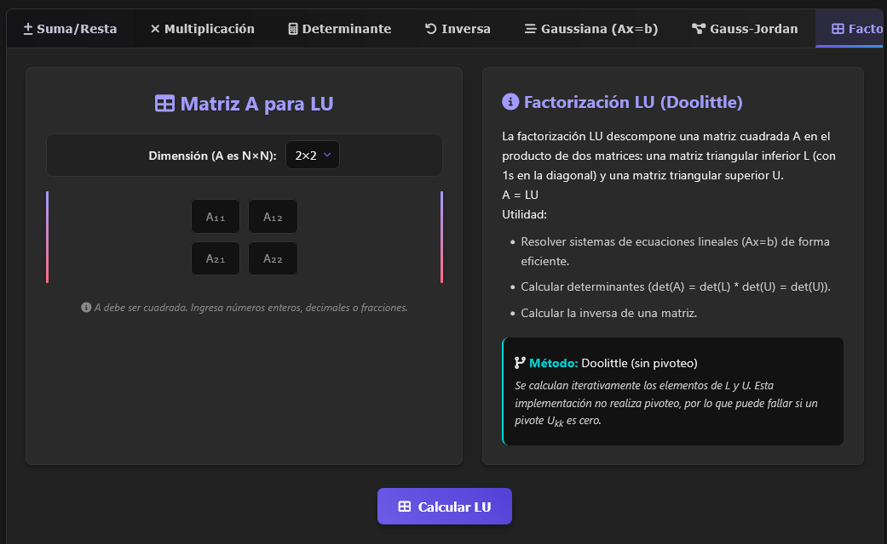
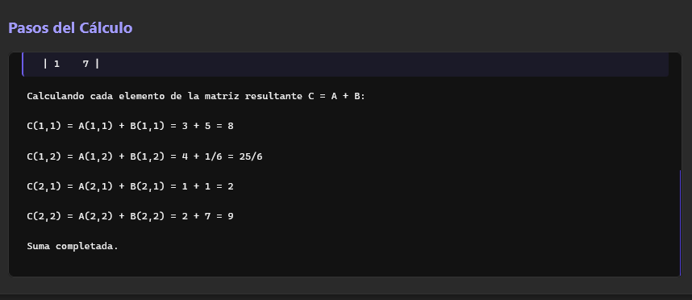

# Calculadora de Álgebra Lineal MAT1187


<div align="center">
  
  <br/>
  <i>Una calculadora potente y didáctica para operaciones de álgebra lineal</i>
</div>

## 📝 Descripción del Proyecto

Esta aplicación es una calculadora de álgebra lineal desarrollada como proyecto para el curso MAT1187. Proporciona herramientas para realizar diversas operaciones matriciales a través de una interfaz web intuitiva, con un backend API desarrollado en Python/FastAPI.

<div align="center">
  
</div>

## ✨ Características

La calculadora ofrece las siguientes operaciones matriciales:

### Operaciones Básicas
- **Suma de Matrices**: A + B
- **Resta de Matrices**: A - B
- **Multiplicación de Matrices**: A × B

### Cálculos Avanzados
- **Determinante**: |A| (hasta matrices 4×4)
- **Matriz Inversa**: A⁻¹ (hasta matrices 4×4)
- **Eliminación Gaussiana**: Resuelve sistemas Ax=b
- **Factorización LU**: Descompone A en matrices L y U
- **Eliminación de Gauss-Jordan**: Resuelve sistemas Ax=b mediante forma escalonada reducida (RREF)

## 📸 Galería de Capturas

<table>
  <tr>
    <td>
      
      <p align="center"><i>Cálculo de determinante</i></p>
    </td>
    <td>
      
      <p align="center"><i>Cálculo de matriz inversa</i></p>
    </td>
  </tr>
  <tr>
    <td>
      
      <p align="center"><i>Eliminación Gauss-Jordan</i></p>
    </td>
    <td>
      
      <p align="center"><i>Factorización LU</i></p>
    </td>
  </tr>
</table>

## 🔍 Conceptos Básicos

### Operaciones con Matrices
- **Suma/Resta**: Las matrices deben tener las mismas dimensiones
- **Multiplicación**: El número de columnas de A debe ser igual al número de filas de B
- **Determinante**: Solo para matrices cuadradas, indica si la matriz es invertible (det(A) ≠ 0)
- **Matriz Inversa**: Solo existe para matrices cuadradas con determinante no nulo

### Sistemas de Ecuaciones Lineales
- **Eliminación Gaussiana**: Transforma [A|b] a forma escalonada y resuelve por sustitución hacia atrás
- **Eliminación Gauss-Jordan**: Transforma [A|b] a forma escalonada reducida, mostrando directamente la solución
- **Factorización LU**: Descompone A = LU donde L es triangular inferior y U es triangular superior

## 💻 Especificaciones Técnicas

### Stack Tecnológico
- **Backend**: Python 3 con FastAPI
- **Frontend**: HTML5, CSS3, JavaScript vanilla
- **Despliegue**: Servidor local (localhost:8000)

### Características Técnicas
- Implementación de algoritmos sin bibliotecas matemáticas externas (NumPy, SymPy)
- Soporte para matrices de hasta 4×4
- Visualización paso a paso de cada operación matricial
- Manejo de casos especiales (matrices singulares, sistemas sin solución, soluciones infinitas)
- Soporte para entrada de fracciones (ej: "1/2")

### Diagrama de Arquitectura

```
┌───────────────┐      ┌───────────────┐
│  Navegador    │      │  Python API   │
│  (Frontend)   │<────>│  (Backend)    │
│  HTML/JS/CSS  │      │  FastAPI      │
└───────────────┘      └───────────────┘
        │                      │
        ▼                      ▼
┌───────────────┐      ┌───────────────┐
│  Interfaz de  │      │  Algoritmos   │
│  Usuario      │      │  Matemáticos  │
└───────────────┘      └───────────────┘
```

## 🚀 Instalación y Uso

### Instalación

1. **Clonar el repositorio**:
   ```
   git clone https://github.com/objval/p1_alg
   cd p1_alg
   ```

2. **Configurar entorno virtual** (recomendado):
   ```
   python -m venv venv
   # En Windows:
   venv\Scripts\activate
   # En macOS/Linux:
   source venv/bin/activate
   ```

3. **Instalar dependencias**:
   ```
   cd backend
   pip install -r requirements.txt
   ```

### Cómo Usar

1. **Inicio del Servidor**:
   ```
   cd backend
   uvicorn main:app --reload
   ```

2. **Acceso a la Interfaz**:
   - Abre tu navegador y visita `http://localhost:8000`

3. **Uso de la Calculadora**:
   - Selecciona la operación deseada en las pestañas superiores
   - Ingresa los valores de la(s) matriz(ces)
   - Haz clic en el botón de operación correspondiente
   - Visualiza el resultado y los pasos del cálculo

<div align="center">
  
  <p><i>Visualización paso a paso de los cálculos</i></p>
</div>

## 🧪 Pruebas

El proyecto incluye pruebas unitarias para todas las operaciones. Para ejecutar las pruebas:

```
cd backend
pytest
```

Para ver la cobertura de las pruebas:

```
cd backend
pytest --cov=.
```

## 📋 Convenciones

- Las matrices se representan como listas de listas en JSON
- Los elementos pueden ser enteros, flotantes o fracciones como strings (ej: "1/2")
- Los resultados mantienen formato de fracción cuando es posible para mayor precisión

## ⚡ Rendimiento

La calculadora está optimizada para:
- Resolver rápidamente operaciones con matrices de hasta 4x4
- Proporcionar pasos detallados del proceso de cálculo
- Manejar eficientemente fracciones para mantener la precisión


## 👨‍💻 Desarrollo

Proyecto desarrollado para MAT1187 - Álgebra Lineal, implementando operaciones matriciales sin depender de bibliotecas matemáticas externas, reforzando la comprensión de los conceptos matemáticos subyacentes.

## 📄 Licencia

Este proyecto está licenciado bajo la Licencia MIT - vea el archivo `LICENSE` para más detalles.

---

<div align="center">
  <p>Hecho para el curso MAT1187</p>
</div>